# Lung System

A project developed for the Pervasive Systems exam of the master degree in Engineering in Computer Science. It takes trace of the quality of the air you breathe. Data are collected into the cloud through the use of sensors attached to a STM32 Nucleo board. Access to the data is provided by a visualization system and a chat bot assistant.

## Slides

If you are interested in the project, you can give a look at the presentations:
1. [Initial Concept](https://www.slideshare.net/LucaMaiano1/student-group-projects-initial-concept-what-are-you-breathing)
2. [MVP](https://www.slideshare.net/LucaMaiano1/pervasive-systems-mvp-what-has-been-done) 
3. [Final Project Presentation](https://www.slideshare.net/LucaMaiano1/pervasive-systems-final-project-presentation-the-sparkle-lung-system) 


## Project Members
1. [Luca Maiano](https://www.linkedin.com/in/lucamaiano/) 
2. [Maria Carmela Dipinto](https://www.linkedin.com/in/maria-carmela-dipinto/) 

## Table of Contents
1. [Visualization](#visualization)
	1. [Rest API](#rest-api)
	2. [Dialogflow](#dialogflow)
	3. [Some Insight](#some-insight)
2. [Hardware](#hardware)
	1. [Software](#software)
	2. [Prototype](#prototype)
	3. [How to lunch the System](#how-to-lunch-the-system)
	4. [Real Measurements](#real-measurements)

## Visualization

The visualization was developed with Flask. Once that a user creates an account, he/she can explore the data throw three main components. The first component exposes the data through some plots developed with Ploty. The second component is a table, that retrieves the data of the last 100 measurements from the database and print them. The third and last component is a chatbot assistant developed using Dialogflow.

To run it locally, open the terminal and run the following commands (on Mac OS and Linux!):

```
cd Desktop
git clone https://github.com/lucamaiano/lungsystem.git
cd lungsystem/Dashboard
```

Now install the requirements. I suggest you to create a virtual enviromnment.

```
pip install -r requirements.txt
```

The first time that you run the app, you should migrate and update the database.

```
flask db migrate -m "import data"
flask db upgrade
export FLASK_APP=main.py
```

If you want to execute the code on Windows, instead of "export", use this command:
```
set FLASK_APP=main.py
```

Run the app.

```
flask run
```


### Rest API
The visualization includes also a Rest API.

| HTTP Method   | Resource URL | Notes |
| ------------- | ------------ | ----- |
| GET | /api/users/<string:id> | Return a user. |
| GET | /api/users | Return the collection of all users. |
| GET | /api/measures | Return the collection of all measurements. | 
| GET | /api/measures/<string:year>/<string:month>/<string:day> | Return the a measurement. |
| POST | /api/measures | Add a new measurement. |


### Dialogflow
Our system includes also a smart bot that could help you reading the data. You can ask him for measures using natural language. The agent can answer questions like "Give the value of pressure and humidity of today at 12pm" or "Tell me the all the parameters of yesterday at 10am". 

You can import the agent into your Dialogflow console. First create the agent.

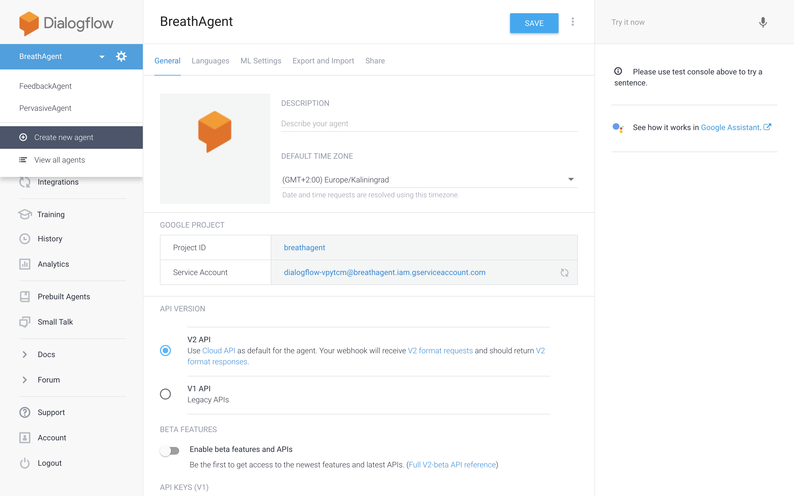


Now you can import it just cliking on "IMPORT FROM ZIP" button

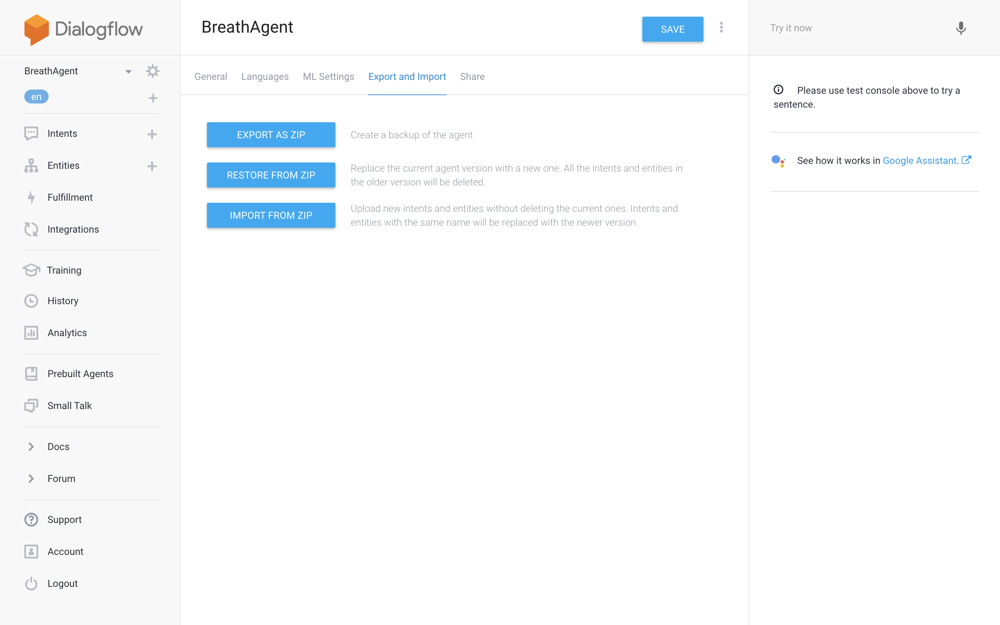


If you want to use it on the project, you must deploy the application on a web server. The simply add the url of your server on the Fulfilment section of Dialogflow.

### Some Insight
Once that you will be registered to the system and start to collect data, you will be able to visualize the data as follows.

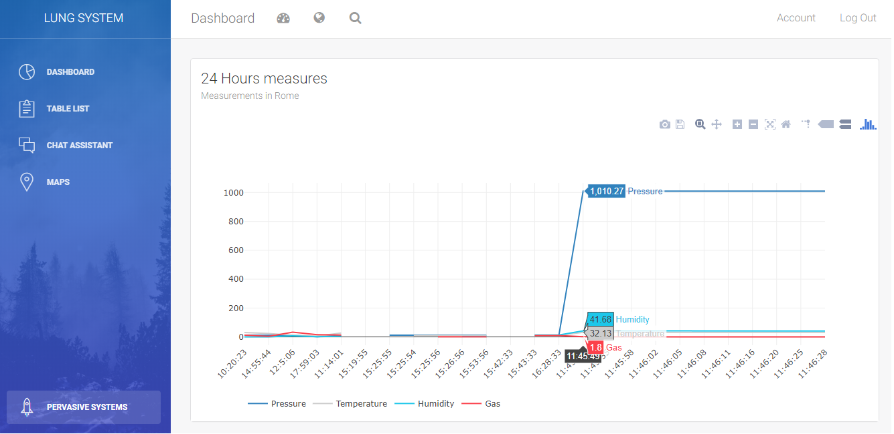


You will also have a table in which you can control the last 100 measures.

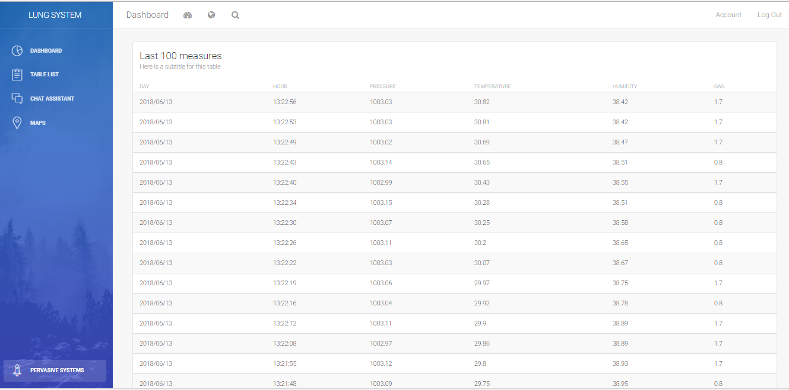


Last but not least, you can even ask measures to the personal assistant

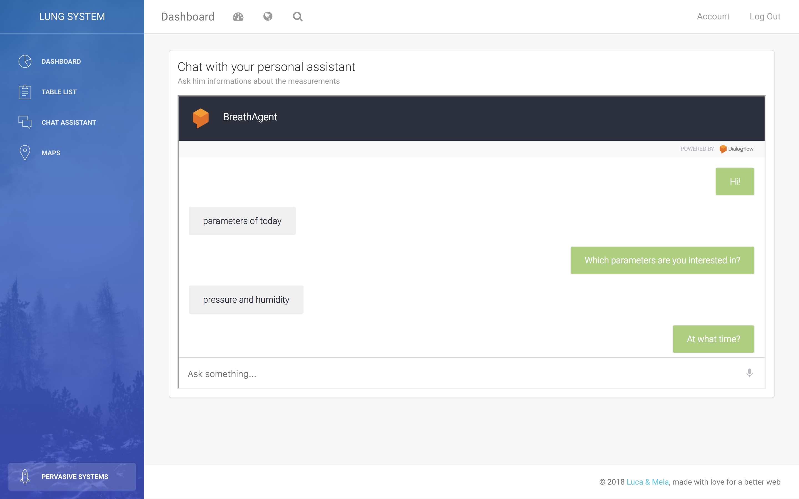


You can use the Dashboard even on mobile, it is completely responsive!

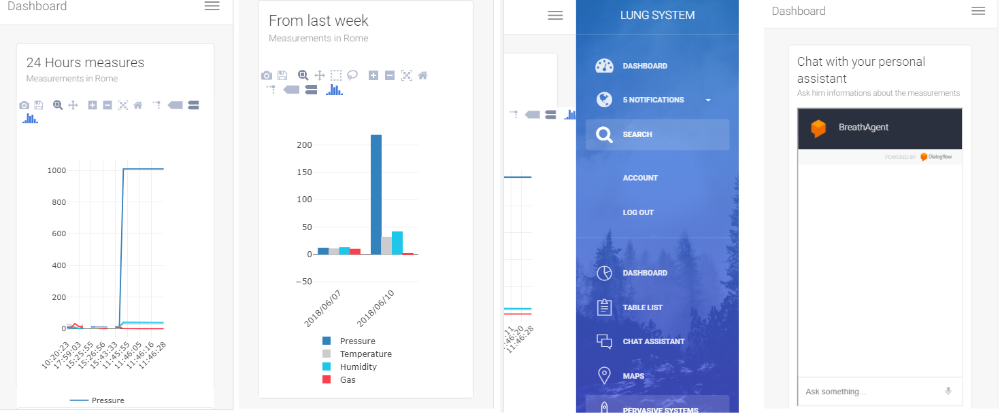


## Hardware
Carbon Monoxide is a tasteless and odourless gas unlike smoke from a fire, so its detection in the home environment is impossible without a dedicate detector. Carbon monoxide is produced by malfunctioning fuel burning devices which can be, for example, a house heating system. We have to be careful to detect its presence in a timely manner because CO is highly toxic inhalant and can be sometimes fatal. CO detector is designed to measure the level of gas over time and to set off a local alarm before dangerous level of gas are present. Home safety alarm are designed to link CO detector to people.

In order to achieve this goals our prototype provide for this hardware:

1. P-NUCLEO-IKA02A1- STM32 Nucleo pack (http://www.st.com/en/ecosystems/p-nucleo-ika02a1.html)

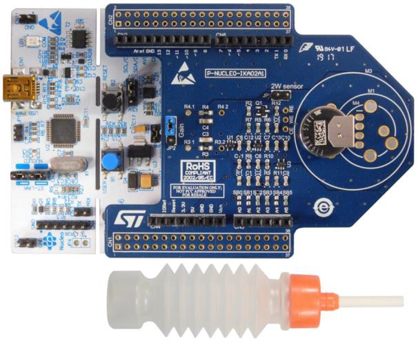

This evaluation pack provides a reference design for various electrochemical sensors. It consists of the STM32 Nucleo Board (We use a NUCLEO-L053R8 optimized for low power applications) further with electrochemical toxic gas sensor expansion board with the Figaro TGS5141 CO sensor,which is linked with the TSU111 operational amplifier. The pack also includes a gas collector.

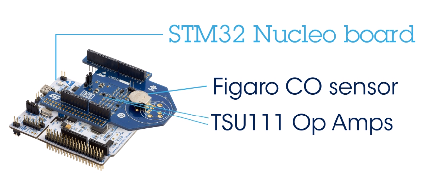

To getting started with this pack follow [this guide](https://github.com/lucamaiano/lungsystem/wiki/2.-Getting-started-with-P-NUCLEO-IKA02A1). 


Useful for good and safety monitoring of the air is to take under control also the pressure, humidity, temperature values of the environment. For these reason our prototype is provided for another board:
2. B-L475E-IOT01A - STM32L4 Discovery kit IoT node (http://www.st.com/en/evaluation-tools/b-l475e-iot01a.html)


The B-L475E-IOT01A Discovery kit for IoT node allows users not only to monitor pressure,humidity and temperature but also,thanks to Wi-fi module, to develop applications with direct connection to cloud servers.

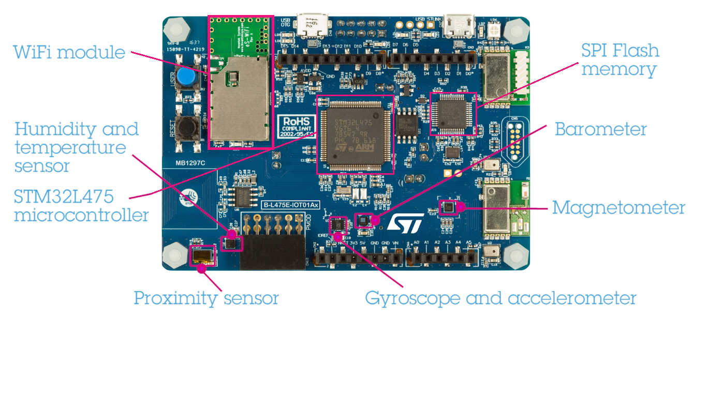

This kit is the quickest way to develop Iot application based on rich hardware,simple software and easy support to connect intelligent node service and build powerful services.

To getting started with this pack follow [this guide](https://github.com/lucamaiano/lungsystem/wiki/3.-Getting-started-with-the-B-L475E-IOT01A-Discovery-kit).


### Software

* Before using the driver on the boards is necessary installing and launch with the boards connected these softwares:
	⋅⋅* STSW-LINK008:ST-LINK/V2-1 USBdriver (http://www.st.com/en/development-tools/stsw-link008.html)
	⋅⋅* STSW-LINK007:ST-LINK/V2-1 firmware upgrade (http://www.st.com/en/development-tools/stsw-link007.html)

* Tera Term (https://ttssh2.osdn.jp/index.html.en). It’s a serial line monitor that helps to read boards’ values. To set the Tera Term windows
	* on Setup/Terminal window set to Receive AUTO and to Transmit LF
	
	
	
	* on Setup/SerialPort window set the Baud rate to 115200
	
	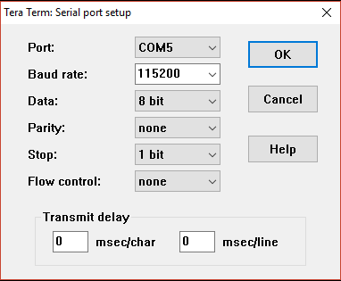
	
	* For P-NUCLEO-IKA02A1:
		1. IAR Embedded Workbench IDE (https://www.iar.com/iar-embedded-workbench/)
		
	* For B-L475E-IOT01A:
		1. IAR Embedded Workbench IDE (https://www.iar.com/iar-embedded-workbench/)
		1. ARM MBED OS (https://www.mbed.com/en/) 
		1. ARM MBED Compiler (https://os.mbed.com/handbook/mbed-Compiler)
		
	To discover how to use the board B-L475E-IOT01A in a Mbed project follow this link  https://os.mbed.com/platforms/ST-Discovery-L475E-IOT01A/	


### Prototype

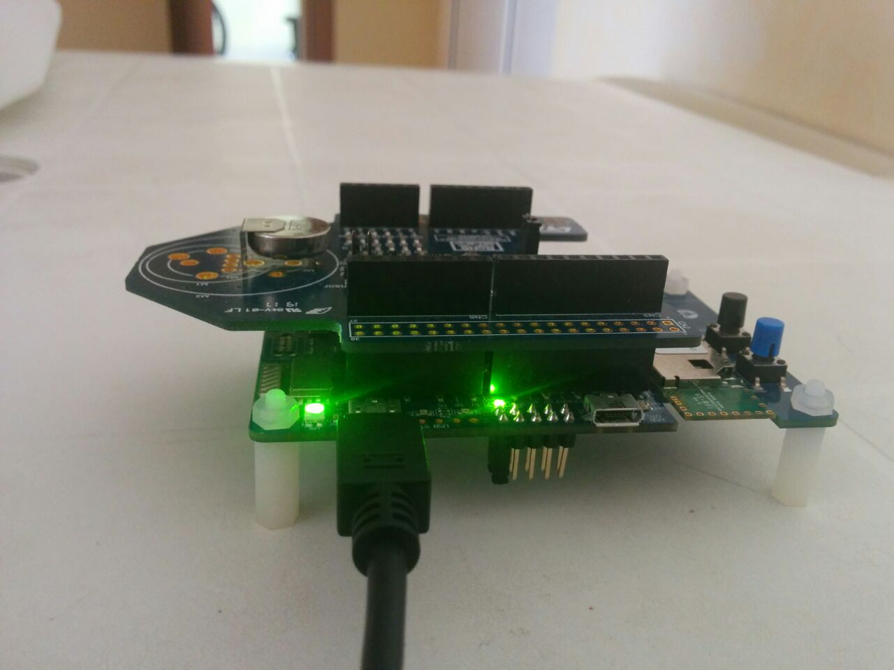
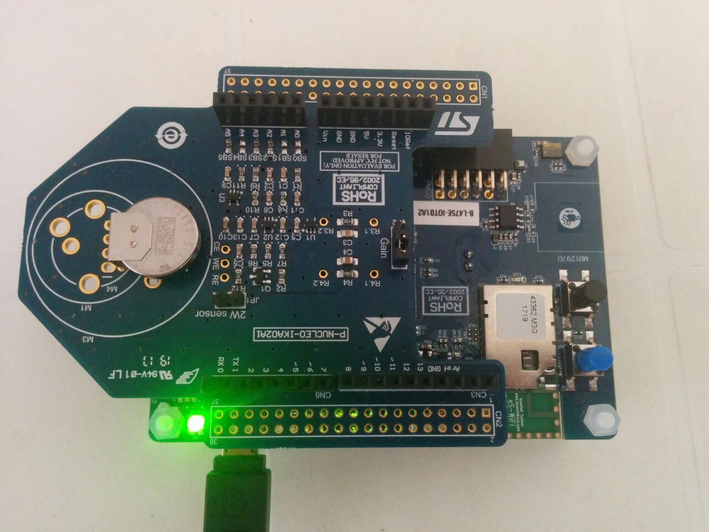

The system works thanks to a python Client that once launched, starts the http server working on the board in listening mode. When the Client asks for the data, the server collects them from the sensors and sends them to the client. After that the Client is able to send all the informations to the Flask Server for the visualization.


### How to Lunch the System

To let the system work:
1. [Install the LungSystem project on the prototype](https://github.com/lucamaiano/lungsystem/wiki/4.-How-to-install-the-LungSystem-project-on-the-prototype)
2. Connect the prototype to the PC. After that on the Tera Term window this screen will be shown: 
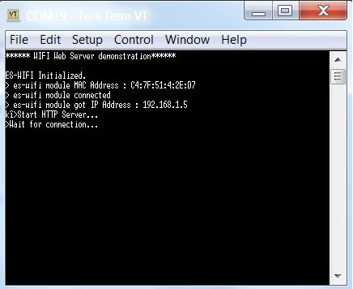
As you can see, the HTTP Server is waiting for a connection.
3. Launch Flask. If Flask can’t work correctly it’s possible to collect the data locally with the script `loadBatch.py`. It will send the data to the Flask server when it will work. To launch loadBatch.py type from terminal the command `python loadBatch.py`
4. Launch the Client on a differnt Terminal window typing the command 
`python Client.py`

The system will ask for the ip address of the Server that is possible to insert manually from command line.

The system now is able to work.

All the data collected will be shown on the Terminal window.

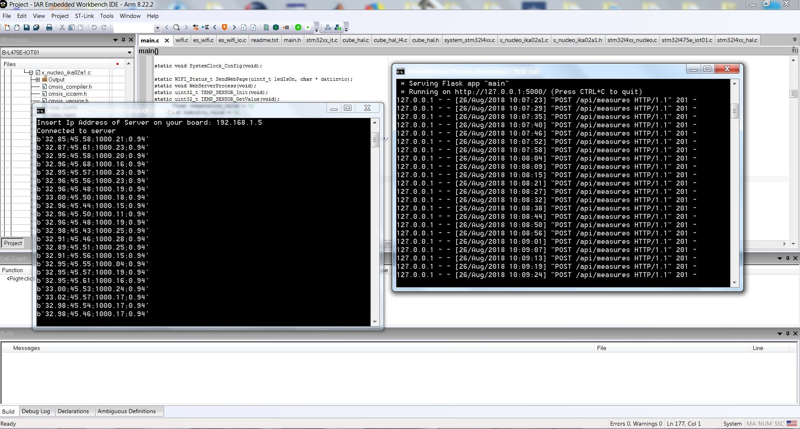

We can see from the window on the left all the data collected from the Client (temperature,humidity,pressure, CO) and after sent to the Flask Server (window on the right). 
Until the Client is stopped, the collection of data is done every 6-7 seconds.
During the collection and sending of the light on the prototype will be flashing red and green like in
[this video](https://github.com/lucamaiano/lungsystem/blob/master/images/video.mp4).


Enjoy it!


### Real Measurements
To test the effectivness of our system, we simulated three different scenarios. We have measured in three different days from 8:00am to 3:00pm.

1. Indoor: Dipartimento Di Ingegneria Informatica, Automatica e Gestionale (DIAG), La Sapienza di Roma

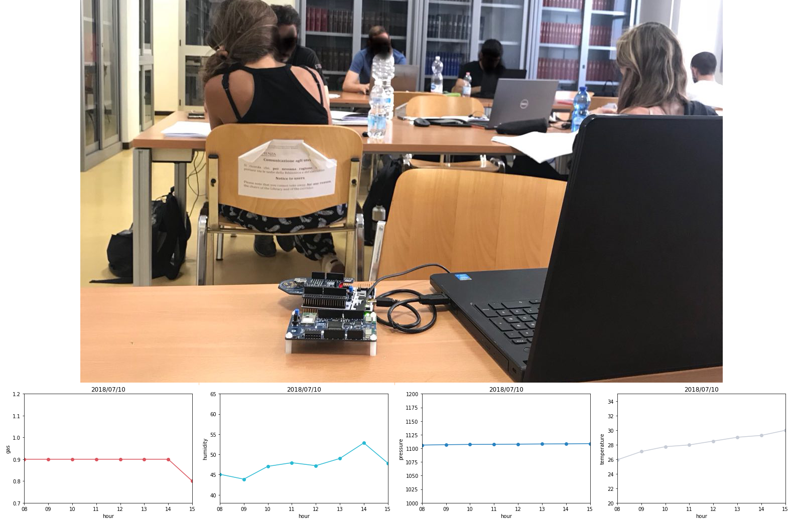

2. Outdoor on the street: Via di Porta Maggiore, Roma

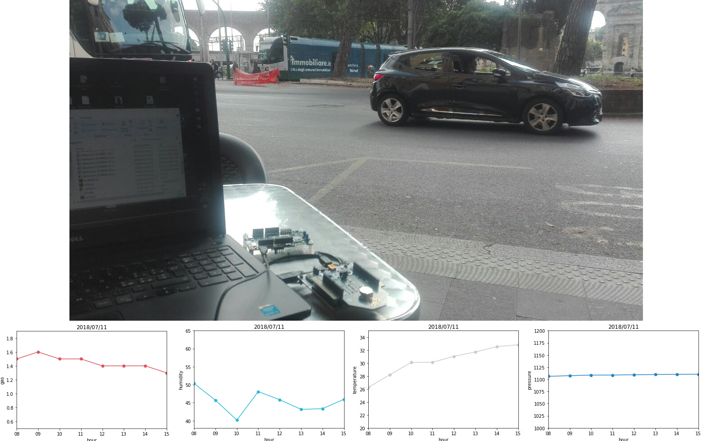

3. Outdoor in a park: Piazza Dante, Roma

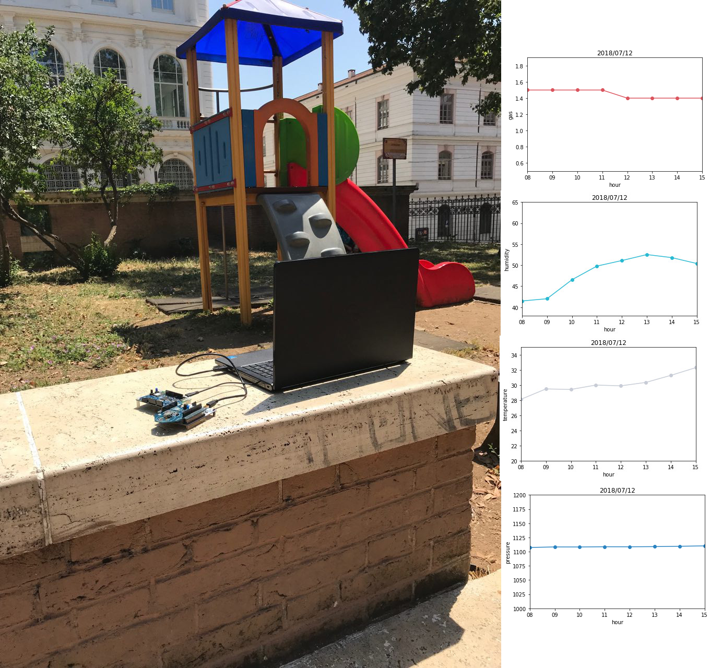

From those results, it seems that there is some kind of variance between indoor and outdoor measurements. The values of gas seem to increase particulary on the street with higher traffic conditions. Instead, it seems that even in a crowded room, the values of gas do not change too much, but there is an evident variation of temperature and humidity. Here the comparison between the values. Starting from left to right you can se the values for DIAG, Porta Maggiore and Piazza Dante.

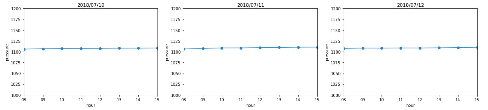

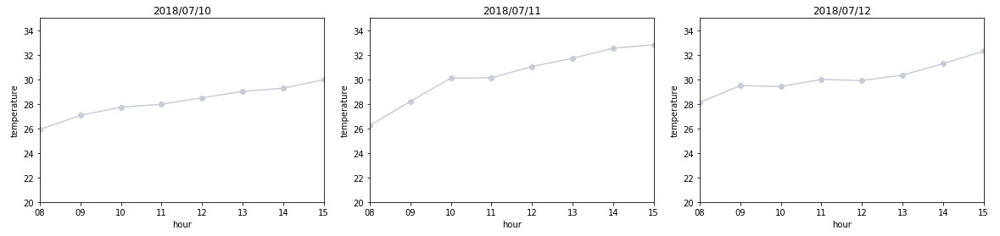

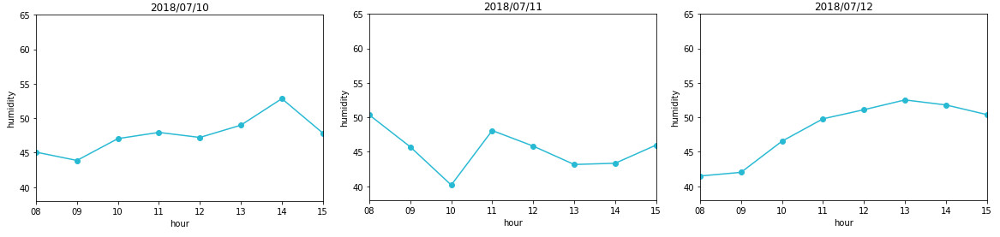

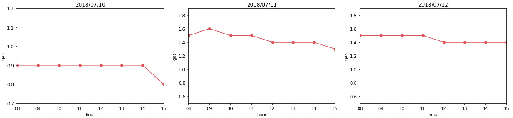
